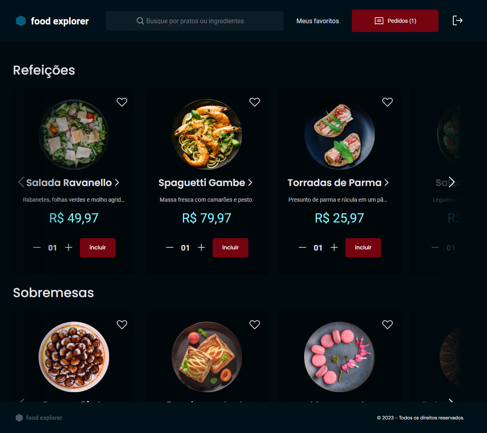
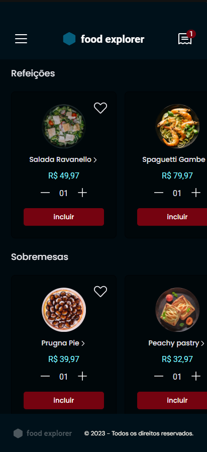

<h1 align="center">Food Explorer FrontEnd</h1>

A FrontEnd app build with Vite tool, and ReactJs as template. Food Explorer is a fictitious restaurant that need a authenticated user to interact with app functions. You can view a menu, and choose one or more options at your taste to buy or set as favorite. There is a payment page that you can see the total amount or remove some product if you want. As Admin you can add, edit and delete options to menu.

<p align="center">
  <a href="#website">WebSite</a>&nbsp;&nbsp;&nbsp;|&nbsp;&nbsp;&nbsp;
  <a href="#technologies">Technologies</a>&nbsp;&nbsp;&nbsp;|&nbsp;&nbsp;&nbsp;
  <a href="#layout">Layout</a>&nbsp;&nbsp;&nbsp;|&nbsp;&nbsp;&nbsp;
  <a href="#clone">Clone</a>&nbsp;&nbsp;&nbsp;
</p>




## [WebSite](https://foodexplorer1000.netlify.app/)

If you wanna see the app as Admin you can access this account.

email: admin@email.com
password: 123456

### BackEnd repository: [Link](https://github.com/andresilveira1/food-explorer-web)

# Technologies

- Vitejs
- ReactJs
- JavaScript
- Axios
- Styled Components
- Swiper
- Radix-ui

# Layout

You can view layout on figma by clicking [here](https://www.figma.com/community/file/1196874589259687769/food-explorer-v2).

# Run

```bash
git clone https://github.com/andresilveira1/food-explorer-web.git

npm install
npm run dev
```
